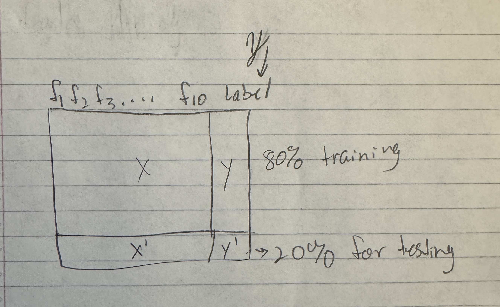
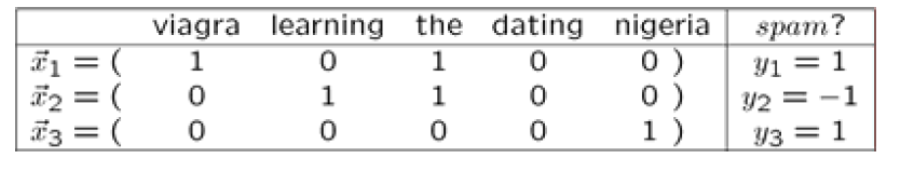

# CS 617 Data Mining Lecture 7: Large-Scale Machine Learning

## Unsupervised versus Supervised

Clustering is often associated with unsupervised learning.

The term **unsupervised** refers to the fact that the input data does not tell the clustering algorithms what the clusters should be.

In **supervised machine learning** the available data includes information about the correct way to classify at least some of the data

The data that are classified already is called the **training set**

## Supervised Learning

For our data, we use 80% of the data for training. The other 20% is used for testing. 



If the y column is categorical data like laabels of 0s and 1s, then it is a **Classification** problem.

If the y column is real numbers like 90, 75, 92.5, etc., then it is a **Regression** problem. 

For Chapter 12 of the Mining of Massive Datasets book, we are focusing on Classification.

The data is labeled:
- Have many pairs {(x, y)}
    - x ... vector of binary, categorical, real valued features
    - y ... class ({+1, -1}, a real number, or a category) 

## Example

We have the height and weight of some dogs from three breeds: Beagles (0), Chihuahuas (1), Dachshunds (2)

- The Beagles (0), Chihuahuas (1), Dachshunds (2) is our `y`

We can think of this data as a **training set**, provided the input data includes the breed of the dog along with the height and weight of each dog

Each pair (**x**, **y**) in the training set consists of a feature vector x of the form **[height, weight]** and the associated label y is the **breed** of the dog

An example of a training-set pair would be: 
- ([5 inches, 2 pounds], Chihuahua)

The goal is to find a function **f(x)**, in which when a new x is given to it, it finds (predicts) the right breed of **x**:
- f([15 inches, 29 pounds]) = Beagles


What if we have some new data points? How do we decide where they go?


## Decision Function

We can create a decision function

The **horizontal line** represents a height of 7 inches and separates Beagles from Chihuahuas and Dachshunds

The **vertical line** represents a weight of 3 pounds and separates Chihuahuas from Beagles and Dachshunds

The algorithm that implements f([height, weight]) is:

```
if (height > 7) print Beagle
else if (weight < 3) print Chihuahua
else print Dachshund;
```

We performed **supervised** learning with the same data augmented by **classifications** for the training data

---

We will talk about the following methods:
- Decision Trees
- k-Nearest Neighbor (Instance based learning)
- Perceptron and Winnow algorithms

## Decision Trees


With **Decision trees** the form of function **f** is a **tree**
- Each node of the tree has a function of x that determines to which child or children the search must proceed

Decision trees are suitable for <u>**binary and multiclass classification**</u>, especially when the <u>**dimension of the feature vector**</u> is **not too large**
- Large numbers of features can lead to overfitting


## Instance Based Learning

Example: **Nearest Neighbor**
- Keep the whole training dataset: **{(x, y)}** 
- A query example (vector) **q** comes
- Find closest example(s) **x***
- Predict **y***

Works both for regression and classification

## k-Nearest Neighbor

We need
- Distance Metric: **Euclidean**
- How many neighbors to look at? **k**


- What is the class of red star when k = 3?
- What about k = 6?


## Perceptron

Perceptron is a linear model and it only works for binary labels

**Example: Spam filtering**



The $x_{1-3}$ are emails and the words have either a 0 or 1 if they are in the email. The labels (the spam column) are binary which tell whether the email is spam or not. If we have a $x_4 = ( 0\ 1\ 0\ 1\ 0)$, we want to figure out whether the label will be spam or not. 

- Instance space x $\in$ X (|X|= n data points)
    - Binary or real-valued feature vector x of word occurrences 
    - d features (words + other things, d~100,000)
- Class y $\in$ Y
    - y: Spam (+1), Not Spam (-1) 

